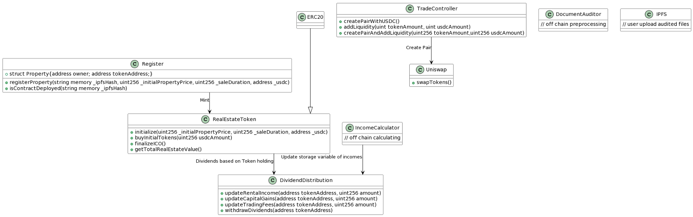

# Live Free

## Description

#### **1. Background**

- Common issues in the global real estate market include high prices, low liquidity, and concentration in investment markets.
- Emphasizes the concept of tokenizing property rights to achieve broader participation and increase market transparency.

#### **2. Goal**

- Fragment real estate to lower investment barriers and increase public participation in the market, preventing monopoly by large funds.
- Incentivize co-owners to earn dividends by renting out properties, releasing housing resources and normalizing market supply and demand.
- Implement AMM for secondary trading of real estate tokens, with token value fluctuations seen as real-time market valuation, reflecting market views on the potential of the area or property.
- Create a win-win opportunity for owners and users, improving the real estate environment.

#### **3. Win-Win Model for Investor & User**

#### Investor

1. **Property Liquidity**
   - Tokenization increases property liquidity and capital utilization.
   - Set up ICO-like mechanisms to boost initial liquidity.
2. **Barrier-Free Market Participation**
   - Investors can participate in the rental market through the platform and enjoy corresponding real estate earnings.
   - Blockchain transparency ensures investors can track the value of their tokens.

#### User

1. **Price Transparency**
   - Increased supply leads to market competition and transparent rental mechanisms.
2. **Reward for Good Tenants**
   - Long-term, well-behaved tenants may receive corresponding level NFTs.

#### **5. Guidelines**

1. **Register Property**
   - Upload property ownership documents to IPFS (InterPlanetary File System).
   - Use a unique identifier to register on the platform.
   - Successful registration gives a RealEstateToken address and generates tokens valued at $1 USD each.
2. **Token Trading**
   - Acquisition channels: Pre-purchase through ICO (primary market) / Buy and trade property tokens through Uniswap (secondary market).

## Framework



## Deploy

1. create .env (ref env.example)
2. forge script script/LiveFree.s.sol --rpc-url https://eth-sepolia.g.alchemy.com/v2/... --broadcast

## Deployed on Sepolia testnet

- Register address: 0xcb394F45B7166587F398408d23F9a682d47539DE
- DividendDistribution address: 0xCC1298D8AaB7289315591B08308F13050DCf9335
- TradeController address: 0x156FA5a894c194E647F621f52f18c6Ea92A1B738
- RealEstateToken address: 0x5AD82AAa06A6440b64a98983c78A032CFFD553D6 (create by ipfs hash QmT7NFqXfvpZ6Q6wW6Lf2P4RgTNQgz3e6rAFSVz1Tvax6w)

## Test

```
// If there is a dependency error, please modify compile version fits 0.8.19
forge test
```
